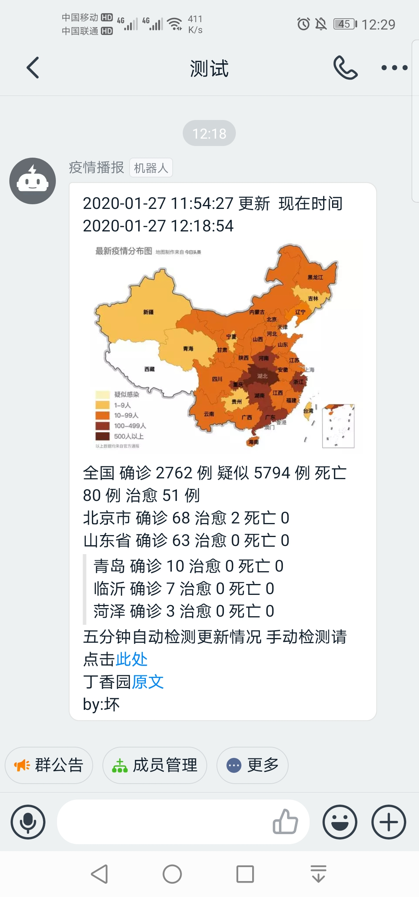
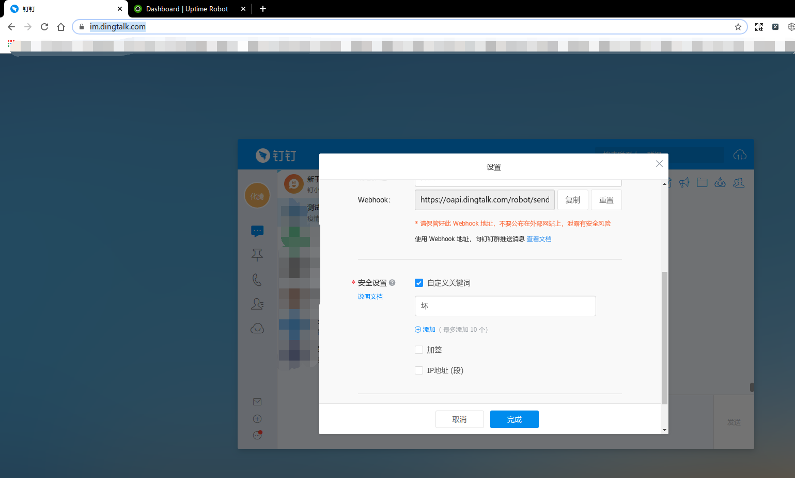
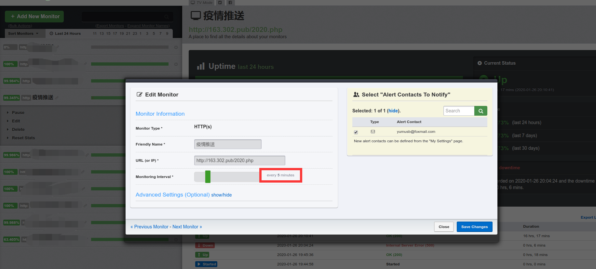

运行思路:

每5分钟去丁香园抓取一次数据，并保存到本地。如果与上次保存到本地的数据不一样，则推送。

使用步骤:

1. 去钉钉的群组里面添加一个WebHook机器人(PC客户端或者网页版 <https://im.dingtalk.com/>)

   

   **安全设置选择自定义关键字**

2. 修改php文件里面的配置项并上传到你的服务器

``` php
//钉钉hooktoken
$token = "上步骤webhook地址后面的token字段";
//临时文件的文件名
$localfilename = "tmp.html";
//页面地址
$pageurl = "你的文件访问页面地址";
//推送地区,如果仅需要省份形式，就例如北京市。需要市级信息，写成数组形式
$jiankong = array('北京市', '山东省' => array("青岛", "临沂", "菏泽"));
//设置的关键字
$keyword="你设置的触发关键字";
```

3. 设置定时运行

   你可以使用计划任务来执行，这里我使用的是 <https://uptimerobot.com/> 里面的监控，每五分钟访问一次。

   

使用到的数据来源:

+ 疫情数据来自丁香园 <https://3g.dxy.cn/newh5/view/pneumonia>
+ 地图数据来自头条API https://i.snssdk.com/forum/home/v1/info/?forum_id=1656388947394568&is_web_refresh=1